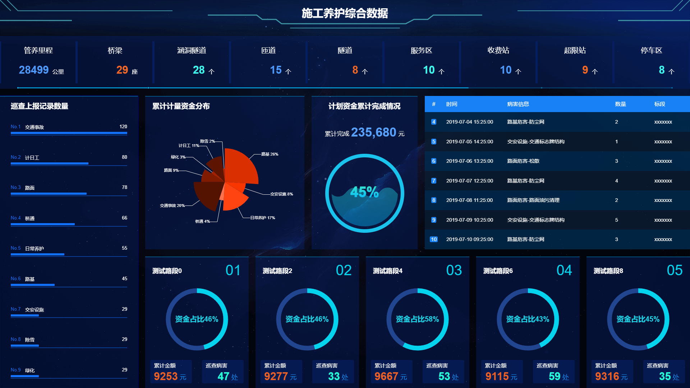

# 数据大屏的解决方案

## 1. 使用缩放比例适配各种设备（适用16*9比例的屏幕分辨率）

1. 封装一个获取缩放比例的工具函数

   ```javascript
   /**
    * 大屏效果需要满足16:9的屏幕比例，才能达到完美的大屏适配效果
    * 其他比例的大屏效果，不能铺满整个屏幕
    * @param {*} w 设备宽度 默认 1920 
    * @param {*} h 设备高度 默认 1080
    * @returns 返回值是缩放比例
    */
   export function getScale(w = 1920, h = 1080) {
     const ww = window.innerWidth / w
     const wh = window.innerHeight / h
     return ww < wh ? ww : wh
   }
   ```

2. 在`vue`中使用方案如下

   ```vue
   <template>
     <div class="full-screen-container">
       <div id="screen">
          大屏展示的内容
       </div>
     </div>
   </template>
   <script>
   import { getScale } from "@/utils/tool";
   import screenfull from "screenfull";
   export default {
     name: "cockpit",
     mounted() {
       if (screenfull && screenfull.enabled && !screenfull.isFullscreen) {
         screenfull.request();
       }
       this.setFullScreen();
     },
     methods: {
       setFullScreen() {
         const screenNode = document.getElementById("screen");
         // 非标准设备（笔记本小于1920，如：1366*768、mac 1432*896）
         if (window.innerWidth < 1920) {
           screenNode.style.left = "50%";
           screenNode.style.transform = `scale(${getScale()}) translate(-50%, 0)`;
         } else if (window.innerWidth === 1920) {
           // 标准设备 1920 * 1080
           screenNode.style.left = 0;
           screenNode.style.transform = `scale(1) translate(0, 0)`;
         } else {
           // 大屏设备（4K 2560*1600）
           screenNode.style.left = "50%";
           screenNode.style.transform = `scale(${getScale()}) translate(-50%, 0)`;
         }
         // 监听视口变化
         window.addEventListener("resize", () => {
           if (window.innerWidth === 1920) {
             screenNode.style.left = 0;
             screenNode.style.transform = `scale(1) translate(0, 0)`;
           } else {
             screenNode.style.left = "50%";
             screenNode.style.transform = `scale(${getScale()}) translate(-50%, 0)`;
           }
         });
       },
     },
   };
   </script>
   <style lang="scss">
   .full-screen-container {
     width: 100vw;
     height: 100vh;
     display: flex;
     flex-direction: column;
     background-color: #131a2b;
     #screen {
       position: fixed;
       width: 1920px;
       height: 1080px;
       top: 0;
       transform-origin: left top;
       color: #fff;
     }
   }
   </style>
   ```

3. mac设备上的屏幕分辨率，在适配的时候，可能不是那么完美，以短边缩放为准，所以宽度到达百分之百后，高度不会铺满
   1. 1432*896  13寸mac本
   2. 2560*1600 ` 4k `屏幕

## 2. 使用第三方插件来实现数据大屏（mac设备会产生布局错落）

 1. 建议在全屏容器内使用**百分比**搭配**flex**进行布局，以便于在不同的分辨率下得到较为一致的展示效果。 

 2. 使用前请注意将`body`的`margin`设为0，否则会引起计算误差，全屏后不能完全充满屏幕。 

 3. 使用方式

    ```bash
    1. npm install @jiaminghi/data-view
    2. yarn add @jiaminghi/data-view
    ```

    ```javascript
    // 在vue项目中的main.js入口文件，将自动注册所有组件为全局组件
    import {fullScreenContainer} from '@jiaminghi/data-view'
    Vue.use(fullScreenContainer)
    ```

    ```vue
    <template>
    	<dv-full-screen-container>
        	要展示的数据大屏内容
            这里建议高度使用百分比来布局，而且要考虑mac设备适配问题，防止百分比发生布局错乱
            需要注意的点是，一个是宽度，一个是字体大小，不产生换行
        </dv-full-screen-container>
    </template>
    <script>
    import screenfull from "screenfull";
    export default {
      name: "cockpit",
      mounted() {
        if (screenfull && screenfull.enabled && !screenfull.isFullscreen) {
          screenfull.request();
        }
      }
    };
    </script>
    <style lang="scss">
    #dv-full-screen-container {
      width: 100vw;
      height: 100vh;
      display: flex;
      flex-direction: column;
      background-color: #131a2b;
    }
    </style>
    ```
 4. [插件地址](http://datav.jiaminghi.com/guide/fullScreenContainer.html)

## 3. 效果图

